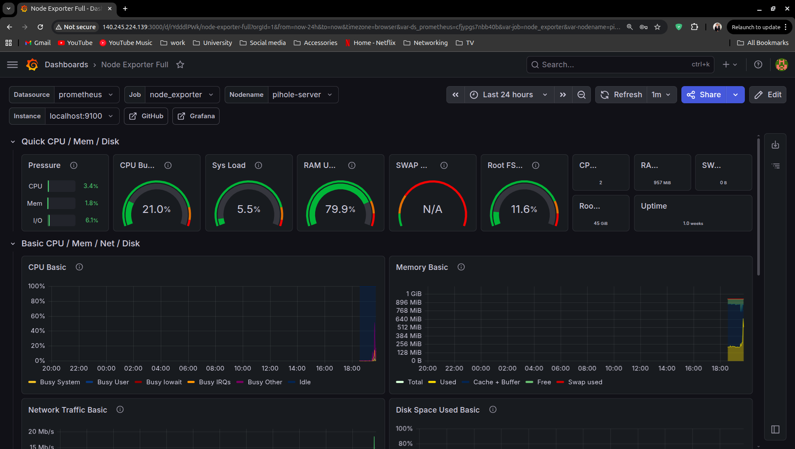

# Network Monitoring Dashboard

### A full monitoring stack deployed on Oracle Cloud using Prometheus,
### Node Exporter, and Grafana

---

## 📋 Project Overview

This project deploys a complete network and system monitoring stack on
an Oracle Cloud free tier VM. Real time metrics are collected by Node
Exporter, stored by Prometheus, and visualized in Grafana dashboards.
The same VM also runs Pi-hole DNS from Project 4, making this a
real multi-service cloud server.

---

## ☁️ Infrastructure

| Detail | Value |
|---|---|
| Provider | Oracle Cloud Free Tier |
| OS | Ubuntu 22.04 LTS |
| Cost | Free (always free tier) |

---

## 🛠️ Stack

| Tool | Version | Purpose |
|---|---|---|
| Prometheus | 2.51.0 | Metrics collection and storage |
| Node Exporter | 1.7.0 | System metrics exposure |
| Grafana | Latest | Metrics visualization |

---

## 📊 Metrics Monitored

| Metric | Source | Panel |
|---|---|---|
| CPU usage % | Node Exporter | CPU Busy |
| Memory used | Node Exporter | RAM Used |
| Network traffic in/out | Node Exporter | Network Traffic |
| Disk I/O | Node Exporter | Disk I/O |
| System load | Node Exporter | System Load |

---

## 🔍 Key Prometheus Queries

**CPU usage:**
100 - (avg by(instance) (rate(node_cpu_seconds_total{mode="idle"}[5m])) * 100)

**Memory used (MB):**
(node_memory_MemTotal_bytes - node_memory_MemAvailable_bytes) / 1024 / 1024

**Network inbound (bytes/sec):**
rate(node_network_receive_bytes_total{device="ens3"}[5m])

---

## 📈 Observations

Generating 50 DNS queries to the Pi-hole server produced a visible
spike in the network traffic panel within one scrape interval (15
seconds). CPU load testing with the stress tool produced an immediate
spike in the CPU panel confirming end to end monitoring pipeline
functionality.

---

## 🔒 Security

All services are protected by iptables firewall rules documented in
the companion Pi-hole project. Only necessary ports are open —
9090 (Prometheus), 9100 (Node Exporter), and 3000 (Grafana).

In a production environment Node Exporter and Prometheus would not
be exposed publicly — they would sit behind a VPN or be bound to
localhost only with Grafana as the single public facing interface.

---

## 🧠 What I Learned

- How Prometheus scrapes and stores time series metrics
- How Node Exporter exposes Linux system metrics
- How Grafana connects to data sources and renders dashboards
- How to write PromQL queries to extract specific metrics
- How to correlate real network events with monitoring data
- How to run multiple services on a single cloud VM

---

## 📁 Files

| File | Description |
|---|---|
| `configs/prometheus.yml` | Prometheus scrape configuration |
| `configs/setup-notes.md` | Setup notes and observations |
| `screenshots/` | Dashboard and verification screenshots |

---

*Deployed on Oracle Cloud Free Tier alongside Pi-hole DNS server —
no cost involved*

